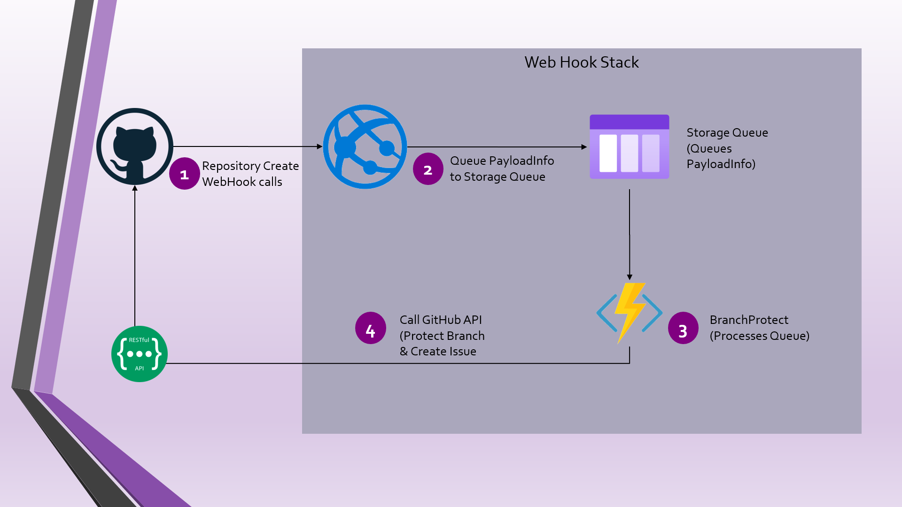

## **GitHub Web Hook**
GitHook WebHook based on Asynchronous WebHook processing

GitHub Actions Status 

This Repository contains an ASP.NET Core Web Api based WebHook with an Azure Function to process payload Asynchronously. The asynchronous processing is based on **[GitHub WebHook Integrations Best Practices recommendation](https://docs.github.com/en/rest/guides/best-practices-for-integrators#favor-asynchronous-work-over-synchronous)**

The Components are described as in below diagram

There are 4 Visual Studio Projects which through which the objectives below are achieved. 

- Use GitHub Powerful API to Protect Master / main branches
- Use Web API to get webhook Calls from GitHub installation
- Web API queues the payload in Azure Storage Queues
- Azure Functions (Queue Trigger) processes the GitHub WebHook payloads

### **Projects in the repository**

1.  **GitHook.Models** -  A generic common model _[PayloadInfo](src/GitHook.Models/PayloadInfo.cs)_ which is used for Seriliazing and Deserializing the payload between different components.
2. **GitHook.BusinessLayer** - A C# Class Library that contains _[BranchProtection](src/GitHook.BusinessLayer/BranchProtection.cs)_ class to manage 2 objectives
    - Call GitHub REST API below through _[Octokit.Net v 0.5.0](https://www.nuget.org/packages/Octokit/0.50.0)_
      - Protect the Branch (Under process as appropriate REST API to protect a branch directly from REST API couldn't be discovered using GitHub REST API Documentation)
      - [Get Repository](https://docs.github.com/en/rest/reference/repos#get-a-repository)
      - [Get Branch Protection](https://docs.github.com/en/rest/reference/repos#get-branch-protection)
      - [Update Branch Protection](https://docs.github.com/en/rest/reference/repos#update-branch-protection)
      - [Retrieve Teams](https://docs.github.com/en/rest/reference/teams#list-teams)
      - [Add team access restrictions](https://docs.github.com/en/rest/reference/repos#add-team-access-restrictions)
      - [Add user access restrictions](https://docs.github.com/en/rest/reference/repos#add-user-access-restrictions)
      - [Add status check contexts](https://docs.github.com/en/rest/reference/repos#add-status-check-contexts)
      - [Set admin branch protection](https://docs.github.com/en/rest/reference/repos#set-admin-branch-protection)
    - [Create an Issue describing Branch Protection applied using @mention tag](https://docs.github.com/en/rest/reference/issues#create-an-issue)

3. **GitHook.WebHook** - A ASP.NET Core Web API (C#) Class Library that contains _GitHookController_ REST API Controller to Receive the Web Hook Calls from GitHub. The WebAPI project has capabilities to do Asynchronous and Synchronous Branch Protection function. 
  The GitHook.WebHook project contains Dependency Injection based _[IPayloadProcessor](src/GitHook.WebHook/Processors/IPayloadProcessor.cs)_ which is set during Application _[Startup.cs](GitHook.WebHook/Startup.cs)_. If UseQueue is set, then _[QueueProcessor](src/GitHook.WebHook/Processors/QueueProcessor.cs)_ is used, else _[DirectProcessor](src/GitHook.WebHook/Processors/DirectProcessor.cs)_ is used. It is recommended to set "UseQueue" to true to achieve below objectives as per **[GitHub WebHook Integrations Best Practices recommendation](https://docs.github.com/en/rest/guides/best-practices-for-integrators#favor-asynchronous-work-over-synchronous)**
    - Be able to return the WebHook response to GitHub in 10 seconds.
    - Process the Payload Asynchronously using [BranchProtect Azure Function](src/BranchProtect)

    When **AppSetting:UseQueue** is set to true, then the below 2 attributes need to be set mandatorily
      - QueueConnection - Full Connection String to a Storage Queue
      - QueueName - Queue Name which would be used by the Asynchronous processor.

4. **BranchProtect** - A C# based Azure Function which has QueueTrigger. The QueueConnection and QueueName are set in the local.settings.json which are also set into the Application Configurations on Azure FunctionApp on Azure. The BrantchProtect Azure Function App has QueueTrigger based Function _BranchProtectionFunc_ which does below tasks
    - Retrieve the Base64 Encoded PayloadInfo
    - Deserialize into PayloadInfo Object [Newtonsoft.Json v 13.0.1](https://www.nuget.org/packages/Newtonsoft.Json/13.0.1)
    - Call `ProtectRepo` function in [GitHook.BusinessLayer.BranchProtection](src/GitHook.BusinessLayer/BranchProtection.cs)

The Complete Overview of the Processflow can be seen in [ProcessFlow](docs/ProcessFlow.md)