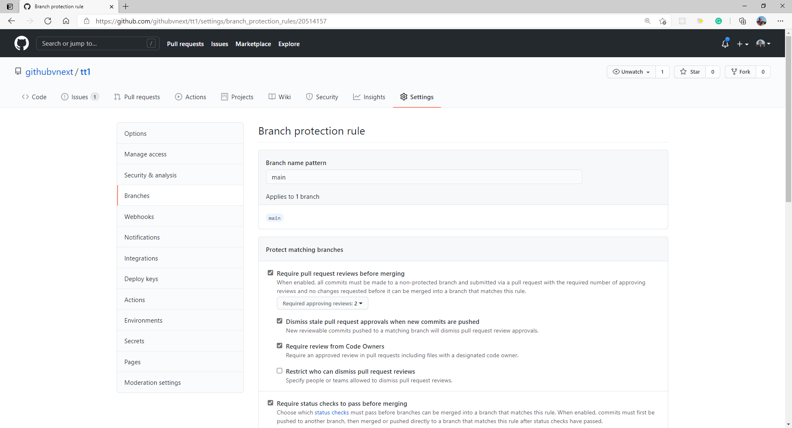
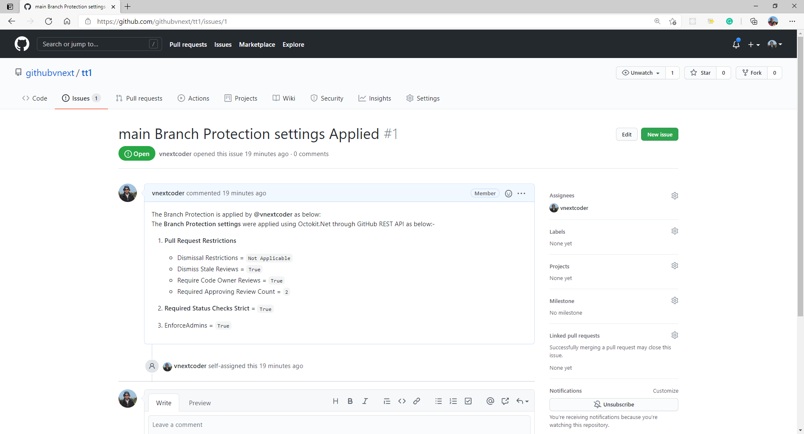

## **AppSettings Set up in Azure Function App Configuration**

````javascript
{
    "IsEncrypted": false,
    "Values": {
        "queueConnection": "<Full Storage Account Connection String>",
        "AzureWebJobsStorage": "<Full Storage Account Connection String>",
        "FUNCTIONS_WORKER_RUNTIME": "dotnet",
        "GitHubToken": "<PAT Token for GitHub account>",
        "GitHubAppName": "<App Name which is used durin Octokit GitHubClient Initialization>",
        "GitHubTeamName": "<Team which is responsible for Code Reviews>"
     }
}
````

The above settings are required to be set in local.settings.json in case you are running the BranchProtect Azure Function locally

Once the App is deployed to the Azure Functions App, the Settings need to be set up in Application Configuration. 

---
## **KeyVault Setup**

If you intend to setup the App Settings with Key Vault, then below actions need to be performed. 

1. Store Key Vault Secrets as below: - 
    - `GitHubAppName` - App Name which is used durin Octokit GitHubClient Initialization
    - `GitHubTeamName` - Team which is responsible for Code Reviews 
    - `GitHubToken` - Required Attribute for authenticating with GitHub REST APIs
    - `queueConnection` - This is used in both queueConnection and AzureWebJobsStorage attribute setting in [`AppSettings_Configuration.json`](AppSettings_Configuration.json)
 
2. Enable System-Assigned Identity for the BranchProtect Azure Function.
3. Set the KeyVault Access Policy to allow System-Assigned Identity `(MSi)` for the BranchProtect Azure Function to have `Get` and `List` Access for secrets in the Key Vault.

4. Setup App Settings as per Sample provided in [`AppSettings_Configuration.json`](AppSettings_Configuration.json). You just need to update the **`<VaultName>`** 

---

## **Results**

Finally once the branch Protection Settings are applied, the below are few snapshots which indicate how the Protection Settings and Issues appear on the newly created Repository.

- Branch Protection Settings Applied



- Issue Raised in the Repository


